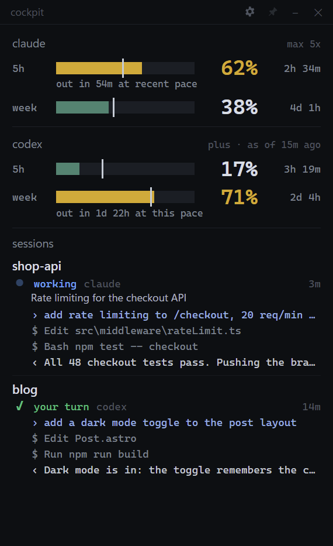
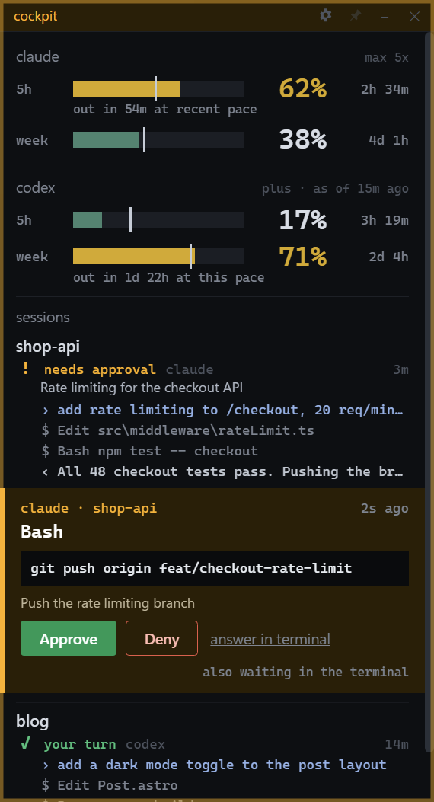

# Claude Codex Cockpit

A small window that stays on top of your other windows and shows what Claude
Code and Codex are up to: how much of your usage limits you've spent, what
each session is doing, and a way to approve or deny tool requests without
switching to the terminal. It can put the same things on a Stream Deck.

<p>
  
  
</p>

I made it to sit on a second monitor while I work in VS Code's terminal. It
runs on Windows and macOS, and everything stays on your computer.

## What it shows

**Usage.** Your 5-hour and weekly limits for Claude Code (Pro and Max plans)
and for Codex. The color follows your pace, not just the number: 60% of the
week used on day 6 is fine, 40% on day 1 is not. The thin line on each bar
marks how much of the window has passed. If you're on track to run out before
it resets, a small note tells you roughly when.

**Sessions.** One row per project folder, with each open session and its last
few messages. A symbol shows where it stands:

| | |
| --- | --- |
| `●` working | `✓` your turn |
| `!` needs approval | `?` needs your input |
| `■` interrupted | `○` quiet for a while |

**Approvals.** When Claude Code or Codex asks for permission, the request
opens in that session's row, showing the exact command, and you get
**Approve** and **Deny** buttons. The window pulses so you notice it from
across the desk. **Always** approves and stops asking. For Claude Code, that
saves the rule its own "don't ask again" would save. For a Codex command, the
cockpit remembers the exact command in that folder.

**Stream Deck.** Laid out for a Stream Deck Mini, in two profiles:

- **Six keys:** the Claude and Codex usage bars, the request that's waiting,
  and **Allow**, **Always** and **Deny** for it.
- **Top row only:** the usage bars and the waiting request, with the bottom
  row free for your own keys. The usage key of the tool whose request is next
  glows yellow, and pressing it allows that request once. Requests are taken
  one at a time, oldest first.

## Install

Download the latest version from the
[Releases page](https://github.com/paulwagnero/claude-codex-cockpit/releases):

- **Windows:** `Claude-Codex-Cockpit-Setup-<version>.exe`, or the `.zip` if
  you'd rather not install.
- **macOS:** `Claude-Codex-Cockpit-<version>-mac-universal.dmg`. It works on
  both Apple Silicon and Intel.

The builds aren't code-signed yet, so the first launch needs one extra click:

- **Windows:** you'll see "Windows protected your PC". Click **More info**,
  then **Run anyway**. If Smart App Control is turned on, Windows may refuse
  unsigned apps altogether; running from source works instead.
- **macOS:** open **System Settings → Privacy & Security** and click
  **Open Anyway**.

To run it from source instead, you need Node.js 20 or newer:

```
git clone https://github.com/paulwagnero/claude-codex-cockpit
cd claude-codex-cockpit
npm install
npm start
```

## Set it up

Click the **gear** at the top of the window and press **connect** next to
Claude Code and Codex. The first time you open the app, this screen shows up
on its own.

Here's what connecting does, so there are no surprises:

- It adds a status line and a permission hook to `~/.claude/settings.json`,
  and a permission hook to `~/.codex/hooks.json`.
- It leaves everything else in those files alone, and saves a backup copy
  next to each file before changing it.
- If you already have your own status line, it keeps showing.
- **disconnect** takes it all back out.

Codex asks you to confirm new hooks: start `codex`, type `/hooks`, and trust
the Claude Codex Cockpit entry. Codex usage itself needs no setup.

**Stream Deck:** press **connect** next to Stream Deck, then quit Stream Deck
from its tray icon and start it again. A Stream Deck Mini switches to the
cockpit keys once; Stream Deck asks you first. After that the keys work
whenever Stream Deck runs, with or without the window open: if the app isn't
running, the plugin starts the cockpit in the background.

To use the top-row layout instead, pick **Claude Codex Cockpit (top row)** in
Stream Deck's profile list. If it isn't there, open
`profiles/Cockpit Mini Top Row.streamDeckProfile` in the plugin folder
(`streamdeck/` in the app) and Stream Deck imports it. On another model, drag
the cockpit's actions onto keys yourself:

| Six keys | | |
| --- | --- | --- |
| Claude usage | Codex usage | Waiting request |
| Allow once | Allow always | Deny |

| Top row | | |
| --- | --- | --- |
| Claude usage, press to allow | Codex usage, press to allow | Waiting request |
| *yours* | *yours* | *yours* |

## Good to know

- **Nothing gets approved without your click,** or a rule you saved with
  **Always**. If you don't answer, or nothing is showing the request (no
  window open and no cockpit keys in view on a Stream Deck), Claude Code and
  Codex simply ask you in the terminal as usual.
- **The two tools wait differently.** Claude Code keeps its own prompt open
  in the terminal while the app waits, so you can answer in either place.
  Codex waits for the app first, for up to 60 seconds, before it shows its
  prompt. Click **answer in terminal** to skip the wait.
- **Claude's numbers** only exist on Pro and Max plans, and they update each
  time Claude Code gets a response.
- **The "out in …" note is an estimate** based on your recent pace, not a
  promise.
- **It stays local.** The app only listens on 127.0.0.1 and makes no network
  requests. It reads files that Claude Code and Codex already write.

## If something's off

- **No Claude numbers?** Check that it's connected (gear icon), then send one
  message in Claude Code.
- **No Codex approvals?** Make sure you trusted the hook with `/hooks` in
  Codex.
- **Stream Deck keys say "cockpit off"?** The plugin couldn't start the
  cockpit; `~/.claude-codex-cockpit/server.log` says why. Keys showing only
  their pictures mean Stream Deck hasn't loaded the plugin: restart Stream
  Deck. The plugin's log is `~/.claude-codex-cockpit/streamdeck.log`.
- **Anything else?** The log is at `~/.claude-codex-cockpit/server.log`.

More detail, such as how approvals behave in each tool, the safety rules,
settings and how to build it, is in [docs/details.md](docs/details.md). How
each tool's behavior was checked is in
[docs/verified-behavior.md](docs/verified-behavior.md).

## License

MIT. This is a personal project, not affiliated with Anthropic or OpenAI.
